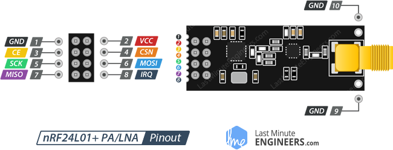

# 2 Step Guide To Wireless Microcontrollers

## A Comprehensive Guide To understanding and building a successful communication between remote arduinos

Wireless communications are awesome, they are universal but how they work is unknown to much of the population. This is unfortunate as you can create many fun and interesting DIY projects including drones, walkie talkies and much more. The fortunate thing is that you have stumbled onto the ultimate guide to learn how to rig your own Microcontroller to communicate wirelessly which hopefully give you the knowledge you need to create your own project

### Components: 

* 2 arduinos (one for transmitting and one for receiving)


* 2 nRF24L01+ Wireless Modules (you can use other modules but you will have to figure out how to wire them yourself)


* Male to Female Jump wires (you’ll need 10)


### Step 1-Rigging the wireless module

First, we should wire the most critical component: the wireless module.

The wireless module we will be using in this tutorial is the nRF24L01+.




Above illustrates the wiring of the nRF24L01+ Wireless Module which we will use for the communication between the arduino. The way we will implement this communication is by creating a transmitter(which will transmit information) and a receiver(which will receive information)


Now on one Arduino using male to female jumper wires implement the above diagram
Repeat for the second Arduino
The wiring is the same for both the transmitter and the receiver as the wireless modules we are using are often called transceivers and can transmit and receive depending on the code.

Now that we have the hardware out of the way let's test it out to see if it is working!

### Step 2 - The Coding

Before we can start programming we are going to have to install some libraries that will allow the two Arduino to communicate:
SPI: https://github.com/PaulStoffregen/SPI/blob/master/SPI.h
RF24: https://github.com/nRF24/RF24

Compile and upload this code to the transmitting arduino:
```
//Include Libraries
#include <SPI.h>
#include <nRF24L01.h>
#include <RF24.h>

//create an RF24 object
RF24 radio(9, 8);  // CE, CSN

//address through which two modules communicate.
const byte address[6] = "00001";

void setup()
{
  radio.begin();
  
  //set the address
  radio.openWritingPipe(address);
  
  //Set module as transmitter
  radio.stopListening();
}
void loop()
{
  //Send message to receiver
  const char text[] = "Hello World";
  radio.write(&text, sizeof(text));
  
  delay(1000);
}
```
[transmitter source code](Code/TransmitterCode.ino)

Compile and upload this code for the recieving arduino:
```
//Include Libraries
#include <SPI.h>
#include <nRF24L01.h>
#include <RF24.h>

//create an RF24 object
RF24 radio(9, 8);  // CE, CSN

//address through which two modules communicate.
const byte address[6] = "00001";

void setup()
{
  while (!Serial);
    Serial.begin(9600);
  
  radio.begin();
  
  //set the address
  radio.openReadingPipe(0, address);
  
  //Set module as receiver
  radio.startListening();
}

void loop()
{
  //Read the data if available in buffer
  if (radio.available())
  {
    char text[32] = {0};
    radio.read(&text, sizeof(text));
    Serial.println(text);
  }
}
```
[receiver source code](Code/ReceiverCode.ino)

If everything is working as intended you should see “Hello World” appearing in your serial monitor but if not recheck the connections between the arduino and the wireless module.


If errors continue to persist there might be a hardware failure within the wireless module or arduino. Don’t hesitate to ask any questions so that we can help you troubleshoot your problem.

### How does this work:
In essence, a packet of data containing the “Hello World” is sent through the transmitter creating radio waves which can then be interpreted by the receiver and turned back into electrical signals to be used within the program.


If you want to learn more about how wireless communication works(specifically the nRF24L01+) go → [here](https://lastminuteengineers.com/nrf24l01-arduino-wireless-communication/) (it's also where I found much of the code and diagrams)

### Conclusion:
Congratulations if you made it this far I am going to assume that you have successfully created your own wireless communication. Now that you are equipped with this knowledge what will you do? Have fun and experiment a bit with you new communication and in no time you utilising it within your own projects. I’d recommend checking out this link where we teach you how to create your own RC car.


